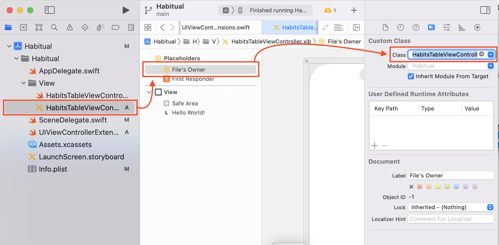
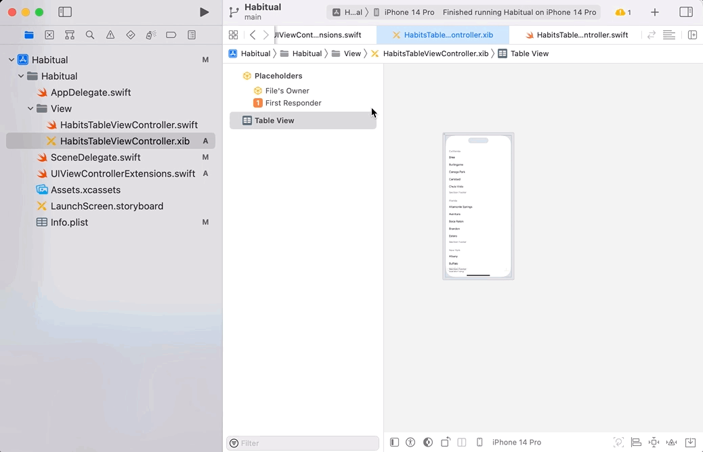

# Adding a UITableView

Now it's time to set up our `UITableView`.

# Using a UITableViewController

The table view is one of the most common display elements on mobile devices. When you see a vertically scrolling list of information it's likely a table view. 

Using a `UITableViewController` will give us some helpful functionality when our screen needs to display a `UITableView`. So, we'll have to change a few things to do this:

> [action]
> In the **MainViewController.swift**, change the superclass of the `MainViewController` from `UIViewController` to `UITableViewController`.

```swift
class MainViewController: UITableViewController { // Change this line! 
	...
```

Then, rename the `MainViewController` to say `HabitsTableViewController`:

> [action]
> Rename the `MainViewController` class in the **MainViewController.swift** file 

> Rename the file name of `MainViewController.swift` to **HabitsTableViewController.swift**. You can double-click or select the file and hit return/enter.

> Rename `MainViewController.xib` to **HabitsTableViewController.xib**. 

> Open that xib file and select the File's Owner object on the left. Then, open the **Attributes Inspector** and update the class to be `HabitsTableViewController`.



> In the **SceneDelegate.swift**, update the `MainViewController.instantiate()` to `HabitsTableViewController.instantiate()`

You will get an error if you run the code at this point! 

The difference between a `UIViewController` and a `UITableViewController` is the `UITableViewController` uses a `UITableView` as its **view**. Whereas a `UIViewController` uses a blank `UIView`.

Thus, you have to replace the view from a `UIView` with a `UITableView`:

> [action]
> Delete the `UIView` we have right now with the label.

> Then from the **Object Library**, drag out a new `UITableView` onto the canvas.

> Now select the **File's Owner** and open the **Connections Inspector** (right click). Look for the **view** connection and connect it with the `UITableView`.

> Select the `UITableView` and open the **Connections Inspector** and connect both the **dataSource** and **delegate** with the `HabitsTableViewController` which is in our case the **File's Owner**.



Run the project and you should see a blank table view. 

This might seem like a lot of work for a blank screen. The steps here are required to get the tableview to function. For your effort, the tableview will do the work of displaying, scrolling and managing any amount of data. 

The next step is to set the datasource. This tells the tableview what to display and how to display it. 

- [01 Main View](./01-Main-View/)
- [03 Populating the TableView](./03-Populating-the-Table-View/)
