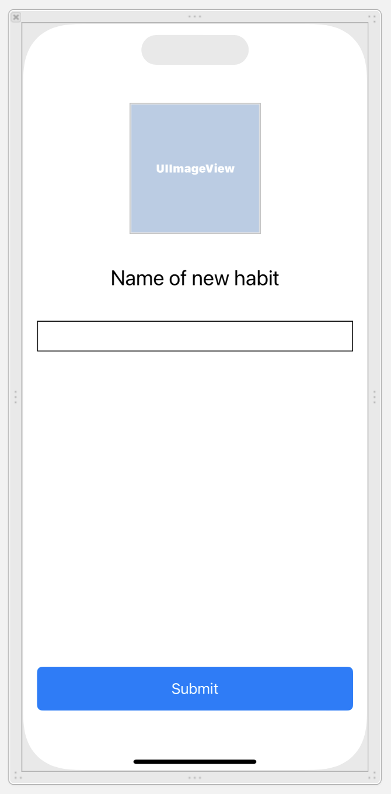
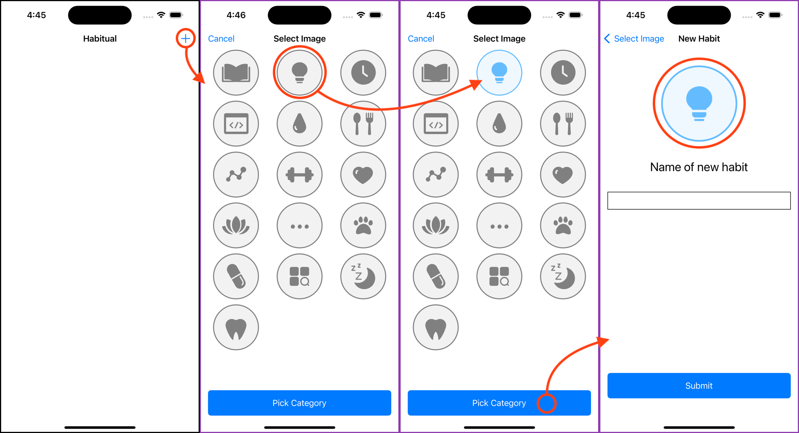

# Confirming the New Habit

# Overview

Remember that on our last page, we create the collection view that showed possible images for our new habit.

From there, a user could select an image of their choosing, but now we need to communicate which image was selected to another view controller so that we can give the new habit a name.

## Creating a New ViewController

>[action]
> Create a new Cocoa Touch Class, Subclass `UIViewController`, and select the XIB option. Name it: `ConfirmHabitViewController`. 

This new `ConfirmHabitViewController.xib` file needs to have some UI elements. The goal is to create a view that shows us the category image, a text field to enter the name of the new habit, and a button to add this habit. You do the work, try and make it look like this: 



Follow these steps:

1. UI elements and constrain them to look like the layout below.
    - UIImageView
    - UILabel
    - UITextField
    - UIButton
2. Add constraints
    - image view has a height and width, align horizontal center and top anchor.
    - label the top anchor to the image, and align the horizontal center. 
    - text field left, right, and top anchors, horizontal center. 
    - button height, left, right, and bottom anchors. 
2. Create *Outlets* for the image view and name it `habitImageView`. 
3. We'll need an outlet for the *textField* and name it `habitNameInputField`.
4. Make sure you also create an `IBAction` for the button and name it `createHabitButtonPressed`. We will use this to create our new Habit.

>[action]
> We need to create a `Habit.Image` variable that will be set by the `AddHabitViewController` but will live as a variable in the `ConfirmHabitViewController`

```Swift
class ConfirmHabitViewController: UIViewController {
    var habitImage: Habit.Images!
    ...
}
```

Now that we have the UI done, we need to be able to navigate to our new `ConfirmHabitViewController` from the `AddHabitViewController`. We also need to tell our *UIImageView* that the image we want to show in the `ConfirmHabitViewController` is going to be the image that the user selected.

> [action]
> In `AddHabitViewController` navigate to `ConfirmHabitViewController` in the `pickPhotoButtonPressed()` function and set the *imageView* to the image that was selected:

```Swift
@IBAction func pickPhotoButtonPressed(_ sender: Any) {
    guard let selectedIndexPath = selectedIndexPath else { return }
    
    let confirmHabitVC = ConfirmHabitViewController.instantiate()
    confirmHabitVC.habitImage = habitImages[selectedIndexPath.row]
    navigationController?.pushViewController(confirmHabitVC, animated: true)
}
```

We want our `ConfirmHabitViewController` to be updated with the new image every time the view appears, do this by creating a `updateUI()` method and calling it in a `viewWillAppear`. 

Note! Don't confuse `viewWillAppear` with `viewDidLoad` the names are similar but they each provide a functionality. These are called lifecycle methods. Lifecycle methods are called during the life of a view. `viewDidLoad` is called when the view is loaded, that's the first time is created. `viewWillAppear` is called just before the is going to be displayed. This app has a couple of different views. We see the list first when we tap the + to add a habit view is shown. We might return the list and then add a new habit. The `viewWillAppear` is called each time a view is about to appear. You can use this to configure the view before you show it. 

In this case, a user is going to select an icon image and then go to the next view, and we will use `viewWillAppear` to display the selected icon/image in the next view. 

>[action]
> Open `ConfirmHabitViewController`. Add a new private method: `updateUI()`. `private` means that we can only access the function within the `ConfirmHabitViewController`. Add this method inside the class but not inside one of the other methods. 

```Swift
private func updateUI() {
    title = "New Habit"
    habitImageView.image = habitImage.image
}
```

> Then update `viewWillAppear` by adding a call to `updateUI`. Add this method to the class but not inside one of the other methods! 

```Swift
override func viewWillAppear(_ animated: Bool) {
    super.viewWillAppear(animated)
    updateUI()
}
```

Test your app. The list of habits is still not there. Tap on the + button. This should show the grid of icons. Tapping one of the icon images should take you to the new view and show the selected icon with the text field and button. 

From the New Habit view tapping the < Select Image button in the upper left should take you back to the previous view. Here you can pick a new image and see that image in the next view. 



## Final Steps

Now we just have to handle the logic to create a habit once the user presses the create habit button.

> [Action]
> Open `ConfirmHabitViewController.swift`. Find the `createHabitButtonPressed()` function. Add the code below. 

```Swift
@IBAction func createHabitButtonPressed(_ sender: Any) {
    var persistenceLayer = PersistenceLayer()
    guard let habitText = habitNameInputField.text else { return }
    
    persistenceLayer.createNewHabit(name: habitText, image: habitImage)
    self.presentingViewController?.dismiss(animated: true, completion: nil)
}
```

The code above makes an instance of `PersistenceLayer`. This is where all of the habit data is stored. 

Next, it gets the text entered in the `habitNameInputField`. The TextField returns an optional string. Use a guard statement here to unwrap the optional or exit the function early. 

If the text was unwrapped successfully it's time to create a new habit by calling `persistenceLayer.createNewHabit` and providing the name and image for that habit. 

Last, dismiss this modal view. This takes us back to the first screen. 


Awesome! Now when you run the app, you should be able to create a habit and have it show up in the `HabitsTableViewController`. Your `ConfirmHabitViewController` should look like this in the simulator:

Testing your app now you should be able to add a new habit with an image, and it should appear on the list. 

You almost have a fully functional app! It took a while to get to this stage but all of the hard work and effort has paid off!

# Summary

In this section, we applied most of our previous knowledge such as creating an `UIViewController` and we also allowed for communication between view controllers by creating a reference to a `ConfirmHabitViewController` and calling its habitImage variable to set that image based on what the user selected. We also put our persistence layer to good use by abstracting away the logic of creating a habit and saving that habit. This technique follows our single responsibility technique as our view controller itself is not responsible for actually creating the `Habit()` object. Onwards to the next section!

- [07 Adding a CollectionView](./07-Adding-a-Collection-View/)
- [09 Detail a Habit](./09-Detail-a-Habit/)

