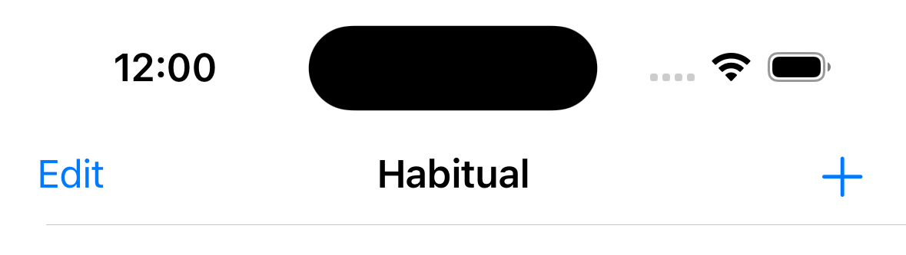
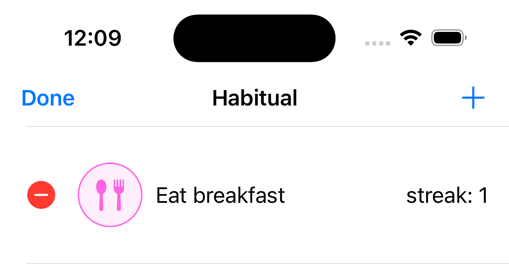
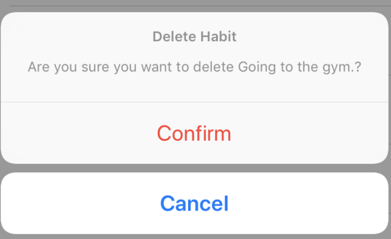

# Final Details

Here is where you will wrap up this project by adding some needed features. 

# Deleting Habits

Our Habitual app is now able to track new habits. But we also want to be able to delete habits, in case we decide we no longer want to track certain things.

To do that let's add an **Edit** button on the left side of the navigation bar.

This is what we want to achieve. Hopefully exercising is not a habit you want to delete when using the app for real purposes.



> [Action] 
> Go to the method `setupNavBar()` in the `HabitsTableViewController` extension and add the following line of code.

```Swift 
navigationItem.leftBarButtonItem = self.editButtonItem
```

The UIKit Navbar has a place for buttons on the left and the right. You can add a button using the `navigationItem` property. Buttons can be custom and there are common default buttons available for easy use.

Test your work. Tapping the Edit button should cause it to Say Done and display the red - next to each list item. The TableView has built-in features that allow you to edit cells. Moving and deleting cells is considered a common operation and the tools for this are built in. 



The red - button is there to delete cells in the tableview but it won't delete them by itself. To delete a cell from the table view you also need to delete the corresponding data from the data source! 

Remember, the table view generates the cells by asking the data source what to display. 

Now let's include the method from the `UITableView` delegate that will let us delete entries. 

> [Action] 
> Find the tableview methods and add a new method. This method is "forRowAt" and should read as it does below. 

```Swift
override func tableView(_ tableView: UITableView, commit editingStyle: UITableViewCell.EditingStyle, forRowAt indexPath: IndexPath) {
  switch editingStyle {
  case .delete:
    // handling the delete action
  default:
    break
  }
}
```

The documentation says: "Asks the data source to commit the insertion or deletion of a specified row." So this is the spot where the tableview is asking, your application to commit to an edit action of some type. Editing styles can be "insert" or "delete". 

The idea is that this method is called with the editing style and the indexpath. Which tells what you want to do (editing style) and where (indexpath.)

https://developer.apple.com/documentation/uikit/uitableviewdatasource/1614871-tableview

This method receives an `editingStyle` parameter. We first check if it corresponds to the delete option with a switch statement. If it matches, then we get hold of the habit from the array with the selected index and save the index we want to delete in another constant.

> [Action] In the method you just added, there is a switch case. Find the delete case and add the two lines of code below to that case. 

```Swift
let habitToDelete = persistence.habits[indexPath.row]
let habitIndexToDelete = indexPath.row
```

This gets the habit that we might want to delete but doesn't do anything else. 

To make sure they want to delete we show the user an alert to ask for confirmation. When asking the user for actions such as editing or deleting elements it is always good practice to ask for confirmation. This will help them avoid doing something they didn't intend to do.



The UIAlertController is a special ViewController that shows those alert dialog boxes. You can configure them in many different ways. To make the Alert controller easier to work with add the following extension. 

> [Action] At the bottom of `HabitsTableViewController.swift`, outside of any of the other code blocks, add the following UIAlertController extension. 

```swift
extension UIAlertController {
  convenience init(habitTitle: String, comfirmHandler: @escaping () -> Void) {
    self.init(title: "Delete Habit", message: "Are you sure you want to delete \(habitTitle)?", preferredStyle: .actionSheet)

    let confirmAction = UIAlertAction(title: "Confirm", style: .destructive) { _ in
      comfirmHandler()
    }
    self.addAction(confirmAction)

    let cancelAction = UIAlertAction(title: "Cancel", style: .cancel)
    self.addAction(cancelAction)
  }
}
```

This extension will allow you to initialize a UIAlertController instance. 

Once the user confirms the action, the `UIAlertController` executes 2 things: deleting the habit entry from our saved entries and deleting the cell at the indexPath we saved before.

> [Action] 
> Find the `switch editingStyle` in the `case .delete:` below the two lines that should be there add the following: 

```Swift
// Create an instance of UIAlertController
let deleteAlert = UIAlertController(habitTitle: habitToDelete.title) {
  // The alert is confirmed delete the habit
  self.persistence.delete(habitIndexToDelete)
  tableView.deleteRows(at: [indexPath], with: .automatic)
}
// Show the Alert Controller
self.present(deleteAlert, animated: true)
```

The final implementation of the method should look like this.

```Swift
override func tableView(_ tableView: UITableView, commit editingStyle: UITableViewCellEditingStyle, forRowAt indexPath: IndexPath) {
  switch editingStyle {
    case .delete:
      let habitToDelete = persistence.habits[indexPath.row]
      let habitIndexToDelete = indexPath.row

      let deleteAlert = UIAlertController(habitTitle: habitToDelete.title) {
        self.persistence.delete(habitIndexToDelete)
        tableView.deleteRows(at: [indexPath], with: .automatic)
      }

      self.present(deleteAlert, animated: true)
    default:
      break
  }
}
```

# Changing the order of habits

Let's say we like to order the habits in a way that the first to be completed during the day goes to the top, and the last habit to be completed during the day is the last on the list.
When adding new habits we need to arrange them where they fit best.

We can use the `UITableView`'s ability to reorder cells for this task.

TableView already has the functionality to rearrange rows but these changes need to be reflected in the datasource. TableView provides a method to let us know when a row has been moved. 

> [Action] Below the last method add a new method. This should go inside the class but outside of any other methods. Add the method: `tableView:moveRowAt:to` (don't confuse it with `canMoveRowAt`)

```Swift
override func tableView(_ tableView: UITableView, moveRowAt sourceIndexPath: IndexPath, to destinationIndexPath: IndexPath) {
  persistence.swapHabits(habitIndex: sourceIndexPath.row, destinationIndex: destinationIndexPath.row)
}
```

This method will move the cell and call the method `swapHabits` in our persistence layer. Let's review the method.

The method will receive the index of the habit we want to move and the new index it will have in the list. You are calling the `swapHabits` method in the `PersistenceLayer`. Find that method and take a look at it: 

```Swift
mutating func swapHabits(habitIndex: Int, destinationIndex: Int) {
  let habitToSwap = self.habits[habitIndex]
  self.habits.remove(at: habitIndex)
  self.habits.insert(habitToSwap, at: destinationIndex)
  self.saveHabits()
}
```

Then it makes a copy of the habit. Removes the entry at the old index, and adds the copy in the destination index. After that, the habits need to be saved to keep the changes.

# The end

We did it! We completed our Habitual app. Along the way we learned:

- Using XIB files
- Setting Constraints
- Creating custom cells
- Use table views and collection views
- Creating a persistence layer with NSUserDefaults
- Structuring code in MVC
- Navigating between screens

# Stretch challenges

There is a lot more you can do to make this app even better and to keep practicing iOS development. Here are a few stretch challenges:

- Make it look good! Our first implementation was focused on getting it to work. Play with colors, fonts, and sizes to make it look better.
- Add a validation when selecting an icon and entering a title. Tell the user if they are missing something and think about what's the best way to do this. Is it a hidden label? an alert?
- Rearrange habits using tap and hold instead of the edit button.
- Implement a Search Bar in the habits table.

- [Detail a Habit](./09-Detail-a-Habit/)
