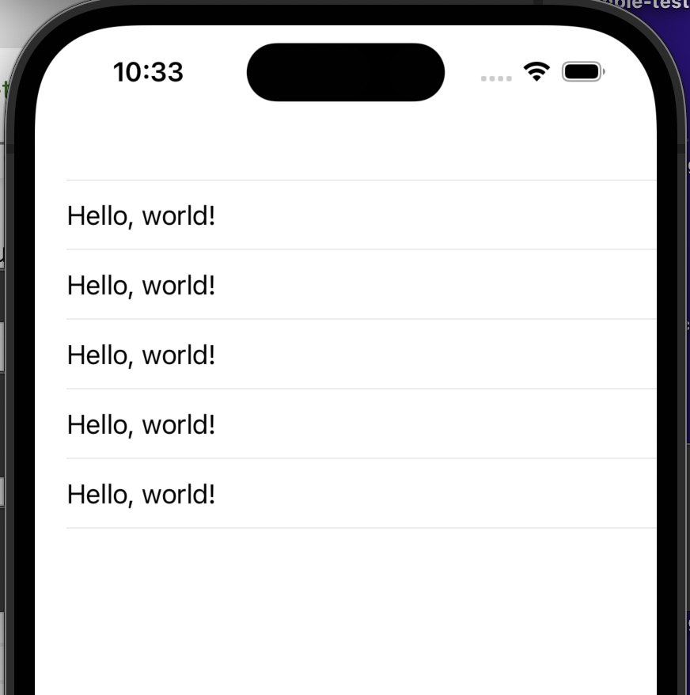

# Populating a Table View

We have an empty table, it's time to get some content showing up.

# Populating the Table View

A little about the `UITableViewController`, by default this class, conforms to the necessary data source methods. These methods are required to populate a `UITableView`. Here are the two required methods:

```swift
// return the number of rows for the given section
func tableView(_ tableView: UITableView, numberOfRowsInSection section: Int) -> Int

// return the UITableViewCell for the given indexPath
func tableView(_ tableView: UITableView, cellForRowAt indexPath: IndexPath) -> UITableViewCell
```

By default, `UITableViewController` implements these methods and returns 0 for the first method and a blank cell for the second method. You will override these methods to make the tableview display your data.

> [action]
> Add the following to **HabitsTableViewController.swift** file, after the **viewDidLoad** method:

```Swift
class HabitsTableViewController: UITableViewController {
        override func tableView(_ tableView: UITableView, numberOfRowsInSection section: Int) -> Int {
        return 5
    }
    override func tableView(_ tableView: UITableView, cellForRowAt indexPath: IndexPath) -> UITableViewCell {
        var cell: UITableViewCell
        if let dequeueCell = tableView.dequeueReusableCell(withIdentifier: "cell") {
            cell = dequeueCell
        } else {
            cell = UITableViewCell(style: .default, reuseIdentifier: "cell")
        }
        cell.textLabel?.text = "Hello, world!"
        return cell
    }
}
```

Should look like this: 



A few things here, you need to add `override` to both of these methods because each method is already implemented in our **superclass**, `UITableViewController`.

## Table View Number of Rows in Section

Look at `tableView(numberOfRowsInSection:)`, this method returns the number of rows to display. Since the sample code returns 5 you see 5 rows. Try changing the number.

This method tells the tableview how many rows to display. 

A tableview can be divided into sections and this method would also tell the tableview how many sections. You can see rows and sections in apps like Settings and Calendar. 

## Table View Cell at IndexPath

Look at `tableView(cellForRowAt indexPath:)`, this "cell for row at index path" returns a `UITableViewCell` and configures that cell. A "cell" is one row displayed by the tableview. In this case, all of the rows display the same thing: "Hello, world!"

The cell for row at index path method determines what each row of the tableview looks like. 

### What is `IndexPath`?

This is a class used by `UITableView` to identify what cell we're referring to.
An `IndexPath` contains two properties; **section** and **row** both are `Int`s.

This gives us an `IndexPath` which depends on what we returned in the first method.
If the first method returned 5, the second method will ask for 5 different cells.
This will make more sense once we run a few examples.

In our implementation for this method, we create a new cell by using `UITableViewCell(style:reuseIdentifier:)` and update the cell's textLabel to say *Hello, World!*.
`UITableViewCell` has four styles we could use.
Later, we'll create our custom cell.

Let's run our project!
We should see five rows that say *Hello, World!*.
Cool!

# Populating a Table View from an Array

This will help us aim closer to making our table view dynamic.
Let's add a property to our `HabitsTableViewController`; we'll be using this new property to populate the table view:

> [action]
> Add the following to **HabitsTableViewController.swift**, at the top of the class, before **viewDidLoad**:

```Swift
class HabitsTableViewController: UITableViewController {
    var names: [String] = ["Alan", "Braus", "Adriana", "Mitchell", "Dani", "Jess", "Dan", "Meredith", "Dan", "Milad"]
    ...
}
```

<!-- -->

> [challenge]
> Update the two table view methods to populate the table view to show the Strings from the names array.

<!-- -->

> [solution]
> `tableView(numberOfRowsInSection:)` returns the count of the array.

```swift
override func tableView(_ tableView: UITableView, numberOfRowsInSection section: Int) -> Int {
    return names.count
}
```

> [solution]
> `tableView(cellForRowAt indexPath:)` will now configure a cell with a string from the array.

```Swift
override func tableView(_ tableView: UITableView, cellForRowAt indexPath: IndexPath) -> UITableViewCell {
    var cell: UITableViewCell
    if let dequeueCell = tableView.dequeueReusableCell(withIdentifier: "cell") {
        cell = dequeueCell
    } else {
        cell = UITableViewCell(style: .default, reuseIdentifier: "cell")
    }

    let name = names[indexPath.row]
    cell.textLabel?.text = name

    return cell
}
```

You changed the first method to return the count of the names array because you wanted one "cell" for each.
In the second method, we had to use the **indexPath.row** to check what cell we needed to populate.
Then, we'd update the **textLabel.text** to be equal to the string at that **indexPath.row**.

Give it a run and see if the names appear on the table view!

# Adding New Rows to the Table View

Here, you are going to be using one of the methods of our **tableView** to add a new row to the table view by pressing a button.

Add the following to **HabitsTableViewController.swift**. the extension should go at the end of the file after the class ends.

```swift
class HabitsTableViewController: UITableViewController {
    ...
}

// Add the extension 
extension HabitsTableViewController {
    func setupNavBar() {
        title = "Habitual" // Add a title to the nav bar
        // Create a UIBarButtonItem
        let addButton = UIBarButtonItem(barButtonSystemItem: .add, target: self, action: #selector(pressAddHabit(_:)))
        // Add the barbuttonitem to the navbar
        navigationItem.rightBarButtonItem = addButton
    }

    // This function handle taps on the bar button item, see #selector above
    @objc func pressAddHabit(_ sender: UIBarButtonItem) {
        names.insert("Hello, World!", at: 0)
        let topIndexPath = IndexPath(row: 0, section: 0)
        tableView.insertRows(at: [topIndexPath], with: .automatic)
    }
}
```

> [Action]
> Now call the `setupNavBar()` method from `viewDidLoad()`

```Swift
override func viewDidLoad() {
    super.viewDidLoad()
    setupNavBar() // Call the new method
}
```

Here, you add a `UIBarButtonItem` to the right side of the navigationItem and when the user taps on the button, it will invoke **pressAddHabit**. This will add *Hello, World!* to the front of the names array. We also use `tableView.insertRows(at:with:)` which will insert a new row at the given `IndexPath`. In our case, it'll add a new row to the top of the table view.

Run the project and tap the add button a few times.

> [info]
> You must update the dataSource, in our case the names array, BEFORE you use `tableView.insertRows(at:with:)`. Otherwise, you'll get an inconsistency error in your debugger. The table view will fact-check by invoking the number of rows.

This is great! But, let's populate more than just a list of Strings.
