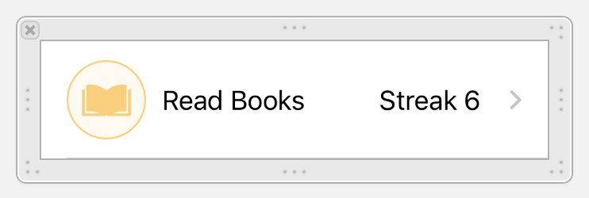
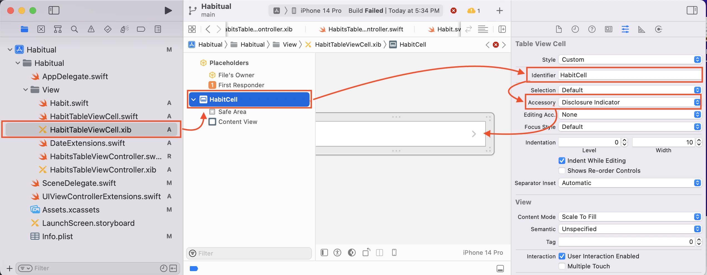
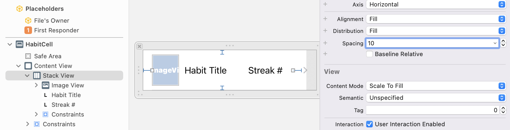
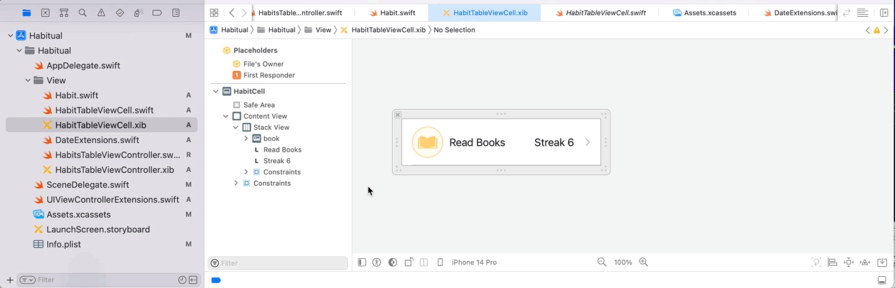
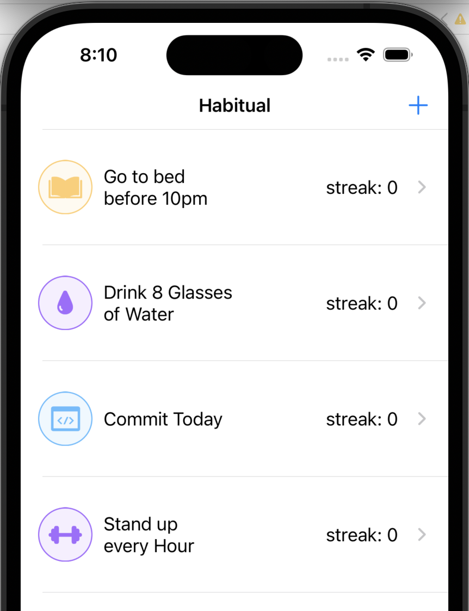

# Building a Custom Cell

For the table, you just created you will be using a custom cell. Sometimes it's easier to use the default cell if the content is simple. For this app, we need more than a label. It should look like this:



> [action]
> Create a new file. File -> New -> File... -> Cocoa Touch Class -> Next. Name it `HabitTableViewCell` and choose the Subclass of `UITableViewCell`. Select the option "Also create XIB file". Then click Next.

This will create two new files. One is the XIB file, where you will arrange all the UI elements in the cell. And the other one is the corresponding Swift file to manage the cell and make further customizations.

> [action]
> Open the `HabitTableViewCell` XIB file and select "Habit Table View Cell" in the tree view. Then open the Attributes inspector and set the identifier "HabitImageCell".

> Next select an Accessory, choose the option "Disclosure indicator", this is the arrow that you see on the right side of the cell. Later we'll add the logic to change the accessory for a Checkmark when the habit is completed.

This is how the properties should look.



# Cell's content

Now let's go back to the cell's design. In the `HabitTableViewCell.xib` XIB file, place a `UIImageView`, and two `UILabel`s. Make the cell look something like this: 


A good idea is to group them in a `UIStackView`: pin the stackview to the edges of the cell, with distribution fill, spacing set to 10, and alignment set to fill.



Give the image a width of 50. The content mode should be Aspect Fit.

Take into consideration that you have two labels in the same line. If there is a habit with a long name, we want that content to be shown incomplete while keeping the streak count visible. Think about this and make your best call with the constraints. 

Tip! Setting the number of lines on a `UILabel` will allow the text of the label to wrap. This might be good for the title but not for the streak.

# Connecting the UI

Add the corresponding outlets to the `HabitTableViewCell.swift` file and make sure to connect them with the elements in the XIB file.

You can do this any way you like. One method would be to add the lines below to `HabitTableViewView` class and then drag from the circle in the margin to the corresponding element in the view. 

```Swift
@IBOutlet weak var imageViewIcon: UIImageView!
@IBOutlet weak var labelHabitTitle: UILabel!
@IBOutlet weak var labelStreaks: UILabel!
```



# Registering the cell

We need a way to tell the `UITableView` to use our new cell instead of the default cell. To do that we register the XIB file in the view controller that has the `UITableView`.

First, add the following code to `HabitTableViewCell`. These lines of code go inside the class but not inside another method! 

```Swift
// Set the identifier for the custom cell
static let identifier = "HabitCell"

// Returning the xib file after instantiating it
static var nib: UINib {
  return UINib(nibName: String(describing: self), bundle: nil)
}
```

Then, open `HabitsTableViewController.swift` to finish registering the cell.
Add the following line of code inside the `viewDidLoad()` method.

```Swift
tableView.register(
  HabitTableViewCell.nib,
  forCellReuseIdentifier: HabitTableViewCell.identifier
)
```

# Using the custom cell

We are done registering the cell and now it's time to use it in the `UITableView`'s delegate method that creates cells.

Find the `cellForRowAt` method and change its content with the following:

```Swift
override func tableView(_ tableView: UITableView, cellForRowAt indexPath: IndexPath) -> UITableViewCell {
  let cell = tableView.dequeueReusableCell(
    withIdentifier: HabitTableViewCell.identifier,
    for: indexPath
  ) as! HabitTableViewCell

  return cell
}
```

Here we are creating cells of type `HabitTableViewCell` and reusing them with our identifier.

# Setting the content

Right now your cells are empty. You need to give them a habit to populate their UI elements.

Find the line: `let habit = habits[indexPath.row]` and add this line below it. 

```Swift
cell.configure(habit)
```

To make it easy to configure the cell you will give the cell a new method. Above you called the new `configure()` method but it hasn't been defined, yet! 

Your `tableView(tableView:cellForRowAt:)` should look like this:

```Swift
override func tableView(_ tableView: UITableView, cellForRowAt indexPath: IndexPath) -> UITableViewCell {
  let cell = tableView.dequeueReusableCell( withIdentifier: HabitTableViewCell.identifier, for: indexPath) as! HabitTableViewCell
  let habit = habits[indexPath.row]
  cell.configure(habit) // Shows an error, you'll fix this next!
  return cell
}
```

To configure a cell you will send a habit from the array to a cell by calling its configure method and passing the habit as a parameter. Let's go back to `HabitTableViewCell.swift` and create the configure method.

```Swift
func configure(_ habit: Habit) {
  self.imageViewIcon.image = habit.selectedImage.image
  self.labelHabitTitle.text = habit.title
  self.labelStreaks.text = "streak: \(habit.currentStreak)"

  if habit.completedToday {
    self.accessoryType = .checkmark
  } else {
    self.accessoryType = .disclosureIndicator
  }
}
```

This method sets the contents of the `UIImageView`, and the `UILabel`s and evaluates if the cell should show the checkmark or the arrow depending on if the habit is completed.

Run the app and see how it looks now. You should see the custom cell by this point.


