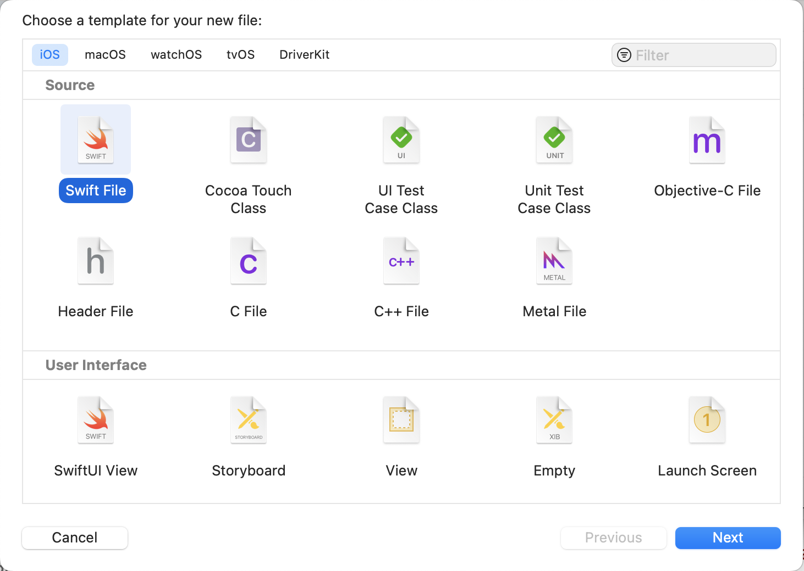

# Persisting Habits

# Persistence #

You are now going to delve into the world of saving data in your application! **Persistence** is a key component that allows us to manage the state of an application.

With persistence, we are trusting the application to store data even after the user exits our application. 

Right now you want to be able to persist habits after the user exits the application. This means you should save the user's habits before they close the app.

# Modifying our Habit struct #

You are going to be using **NSUSerDefaults** to manage persistence in your app. To be able to save objects of type `Habit` you need to make a few changes in the `Habit` struct to make it conform to the Encodable & Decodable protocol. You can achieve this by adding the `Codable` type to the struct.

> [Action] 
> In `Habit.swift` find the lines shown below and modify them. 

```swift
struct Habit: Codable { // Add the Cofable Protocol
...

enum Images: Int, CaseIterable, Codable { // Add the Codable Protocol
...

```

# Creating the persistence layer

> [action] 
> To start create a new Swift file: `PersistenceLayer`. File > New > File...



> Add the following code: 

```Swift
struct PersistenceLayer {
    // Step 1
    private(set) var habits: [Habit] = []

    // Step 2
    private static let userDefaultsHabitsKeyValue = "HABITS_ARRAY"

    init() {
        // Step 3
        self.loadHabits() 
    }
}
```

Introducing our first code snippet, let's analyze what is happening!

**Step 1**: Creating an *array* of habits, but what's this **private(set)** we are seeing? 
    - We are making a setter variable which means that we can write to our array of habits
    - We are using private because we only want our array of habits to be accessible through our persistence layer

**Step 2**: This constant is created as a key in User Defaults to store our array of habits
    - User Defaults are used to store basic data types as long as the app is installed. Basic data types include strings, floats, arrays, bools, etc.
    - We are making this constant static because we only want one instance of this key no matter how many times this persistence layer is instantiated

**Step 3**: This hasn't been defined yet, you will define it in the next step, this method will load habit data from NSUserDefaults. 

> [action] 
> Let's add this function to our persistence layer. Add the method below to the `PersistenceLayer` class.

```Swift
 // Step 4
 private mutating func loadHabits() {

    // Step 5
    let userDefaults = UserDefaults.standard

    // Step 6
    guard let habitData = userDefaults.data(forKey: PersistenceLayer.userDefaultsHabitsKeyValue),
        let habits = try? JSONDecoder().decode([Habit].self, from: habitData) else {
        return
    }

    self.habits = habits
 }
```

**Step 4**: We make this function mutating because we want to alter the copy of data that is assigned when a user instantiates this persistence layer, for more information on this refers to the difference between value and reference types!

**Step 5**: Instantiate our user defaults

**Step 6**: Grab our array of habits from our User Defaults for the given key we made earlier

Decode the data that it gives us into a swift Habit object, and lastly populate our array of habits with our new Habit object!

Now that the user can load a collection of their habits, they have to have a way to create a habit and persist in it!

Much of the code may appear to be very opaque at the moment. I'll summarize. PersistanceLayer is a struct. It has a couple of variables and methods. 

The habits variable contains the list of habits. 

PersistenceLayer loads and saves the habits array to a "place" called NSUserDefaults. This is a feature built into the phone that allows developers to store data outside of their apps. 

NSUserDefaults saves data using a key. Think of the key as a string that names the data you are saving. In this case, the key is stored in userDefaultsHabitsKeyValue and is "HABITS_ARRAY". 

When you want to load the habits data you give NSUserDefaults the key "HABITS_ARRAY" and it returns the data. 

The code you have written so far loads the habits, you'll be adding code that saves habits next. 

# Creating habits

> [action] 
> Let's create a createNewHabit function. Add the code below inside the struct. 

```Swift
 // Step 7
 @discardableResult
 // Step 8
 mutating func createNewHabit(name: String, image: Habit.Images) -> Habit {
    let newHabit = Habit(title: name, image: image)
    self.habits.insert(newHabit, at: 0) // Prepend the habits to the array
    self.saveHabits()

    return newHabit
 }
```

**Step 7**: What is this weird '@discardableResult' we are seeing? Well, we add this decorator to this function because we are not going to be using the result of this function directly, if not the compiler will generate a warning for us!

**Step 8**:
 - We create a new habit with the attributes that the user passes in
 - We are prepending our habit to our habit array as denoted by inserting at index 0
 - We then save our new habit and return that new habit

Phewwww, we've been at it a while, make sure you take some time to stretch.

Now that the user can load and create their habits we have to find a way to **save** those changes!

# Saving habits

> [action] 
> Let's add this function to our persistence layer. Add the code below to the `PersistenceLayer` struct.

```Swift
 private func saveHabits() {
    // Step 9
    guard let habitsData = try? JSONEncoder().encode(self.habits) else {
        fatalError("could not encode list of habits")
    }

    // Step 10
    let userDefaults = UserDefaults.standard
    userDefaults.set(habitsData, forKey: PersistenceLayer.userDefaultsHabitsKeyValue)
    userDefaults.synchronize()
 }
```

**Step 9**: We handle our decoding logic in a guard statement providing us with an early exit if we can't decode our array of habits
 - If we can not decode our array of habits the app will crash with the error statement provided

Step 10: If we do successfully decode our array of habits we then set that JSON data inside our User Defaults for its given key!

Good work, let's keep grinding! We can load, create, and save our habits, but what if the user wanted to **delete** a habit from User Defaults? Resulting in that habit being immediately deleted and not persisting to the next lifetime of the application.

# Deleting habits
> [action] 
> Let's create a delete habit function!

```Swift
// Step 11
mutating func delete(_ habitIndex: Int) {
    // Remove habit at the given index
    self.habits.remove(at: habitIndex)

    // Persist on the changes we made to our habits array
    self.saveHabits()
}
```

Only a few more functions we need to add to make this persistence layer complete. We know that a user can complete a habit and increase their current streak, the question is how we persist that data and implement that logic.

# Complete a habit

> [action] 
> Let's add this markHabitAsCompleted function:

```Swift
mutating func markHabitAsCompleted(_ habitIndex: Int) -> Habit {
    // Step 12
    var updatedHabit = self.habits[habitIndex]

    // Step 13
    guard updatedHabit.completedToday == false else { return updatedHabit }

    updatedHabit.numberOfCompletions += 1

    // Step 14
    if let lastCompletionDate = updatedHabit.lastCompletionDate, lastCompletionDate.isYesterday {
        updatedHabit.currentStreak += 1
    } else {
        updatedHabit.currentStreak = 1
    }

    // Step 15
    if updatedHabit.currentStreak > updatedHabit.bestStreak {
        updatedHabit.bestStreak = updatedHabit.currentStreak
    }

    // Step 16
    let now = Date()
    updatedHabit.lastCompletionDate = now

    // Step 17
    self.habits[habitIndex] = updatedHabit

    // Step 18
    self.saveHabits()
    return updatedHabit
}
```

**Step 12**: We create a variable called updatedHabit that stores the habit at the given index.

**Step 13**: The next step is checking if that habit has been completed for the day
    - If the habit has not been completed then we increment the number of completions by 1
    - If it has already been completed then we return out of this function with the same habit

**Step 14**:
    - We create a constant that is going to store the value of the current habit's last completion date
    - With that value, we check if that date was yesterday 
    - If so then we increment the streak of the habit by 1
    - If it wasn't completed yesterday we set the current streak to 1 denoting either it's a new habit or the user lost their streak on the habit

**Step 15**: We then check if the current streak of our chosen habit is better than that habit's best streak!

**Step 16**: It's important to update the completion date of the habit so that our previous logic is still accurate at a later time!

**Step 17**: We then change the chosen habit to reflect the updated habit with changes we made

**Step 18**: Lastly we save the changes made to our habits array and return the newly updated habit

# Swap habits

We made it, with the help of two more functions our persistence layer will be good to go! If the user wanted the ability to swap habits from the order they came to reflect importance, we should give them that ability.

```Swift
// Step 19
mutating func swapHabits(habitIndex: Int, destinationIndex: Int) {
    let habitToSwap = self.habits[habitIndex]
    self.habits.remove(at: habitIndex)
    self.habits.insert(habitToSwap, at: destinationIndex)
    self.saveHabits()
}

// Step 20
mutating func setNeedsToReloadHabits() {
    self.loadHabits()
}
```

**Step 19**: The first function takes two parameters a habitIndex and a destinationIndex representing the two indices of the habits you want to swap
    - We remove the current habit from its position and insert it at the destination index
    - We then save the newly made changes to our habit array

**Step 20**: The next function comes in handy after we added a new habit and update the collection of habits present in the table view!

# Integrating the persistence layer

Great job folks! Pat yourself on the shoulder and let's move towards the next step! Let's go back to `HabitsTableViewController` and create an instance of our persistence layer

> [Action]
> Open `HabitsTableViewController.swift`. Add the following to the top fo the class: 

```swift
private var persistence = PersistenceLayer()
```

> [Action] 
> Currently you have an array named `habits` that stores a mock-up list of habits. Shown below. Delete this. 

```Swift
var habits: [Habit] = [
    Habit(title: "Go to bed before 10pm", image: .book),
    ...
```

The code can be deleted now because the app is now getting the list of habits from `PersistenceLayer`. 

First, let's change the method of the table's data source that says how many rows there will be.

> [Action]
> Find the line below and make the change shown. 

```swift
override func tableView(_ tableView: UITableView, numberOfRowsInSection section: Int) -> Int {
    return persistence.habits.count // Change! 
}
```

Now, before calling the `configure()` method on each cell. Let's grab the correct habit from the saved array.

> [Action]
> Find the line below in the `tableView(_ cellForRowAt indexPath:)` method and make it look as shown below: 

```swift
let habit = persistence.habits[indexPath.row]
```

Whenever we load this view controller, we want to load the habits. We can achieve that by adding the method `viewWillAppear()` and calling our reload function from the persistence layer. Don't forget to tell the table to reload its content.

> [Action]
> Add the new method below to the `HabitsTableViewController` class: 

```swift
override func viewWillAppear(_ animated: Bool) {
    super.viewWillAppear(animated)

    persistence.setNeedsToReloadHabits()
    tableView.reloadData()
}
```

The button in the upper right will have a problem. it's looking for the `habits` array that has now been deleted. 

> [Action]
> Remove the code inside the `@objc func pressAddHabit(_ sender: UIBarButtonItem) {`... It should look like this: 

```Swift
@objc func pressAddHabit(_ sender: UIBarButtonItem) {
    // Everything here was removed! 
}
```

That's it! We are now using our array of habits that lives in the persistence layer. This information will live as long as the app is installed on the phone.

If you run the app now, you'll get an empty table, because we haven't saved any habits.

If the app runs without errors and shows an empty list, it's working! 

You should see the App name at the top and the + button in the upper right. 
