# Creating A Habit

Our app so far looks to have many of the barebones components that we need to at least show our habits. However, how can we show off our habits without creating them first? Let's do that now!

# Outline

First, when we are going through the process of creating the habit, we will select an image that represents the habit.

To do this, we will setup a new view controller that will have a collection view and each cell will be an image with some icon representing a habit.

Next, we will allow our users to select an image from the collection view. This image will be highlighted.

Lastly, once the user is done with selecting their image, we will have a button that will allow them to pick a photo and to transition to the confirmation screen.

## Creating the New ViewController

> [action]
> Create a new `UIViewController` with the *XIB file choice* selected,
> name it *AddHabitViewController*. Choose File > New > File... Select "Cocoa Touch Class":

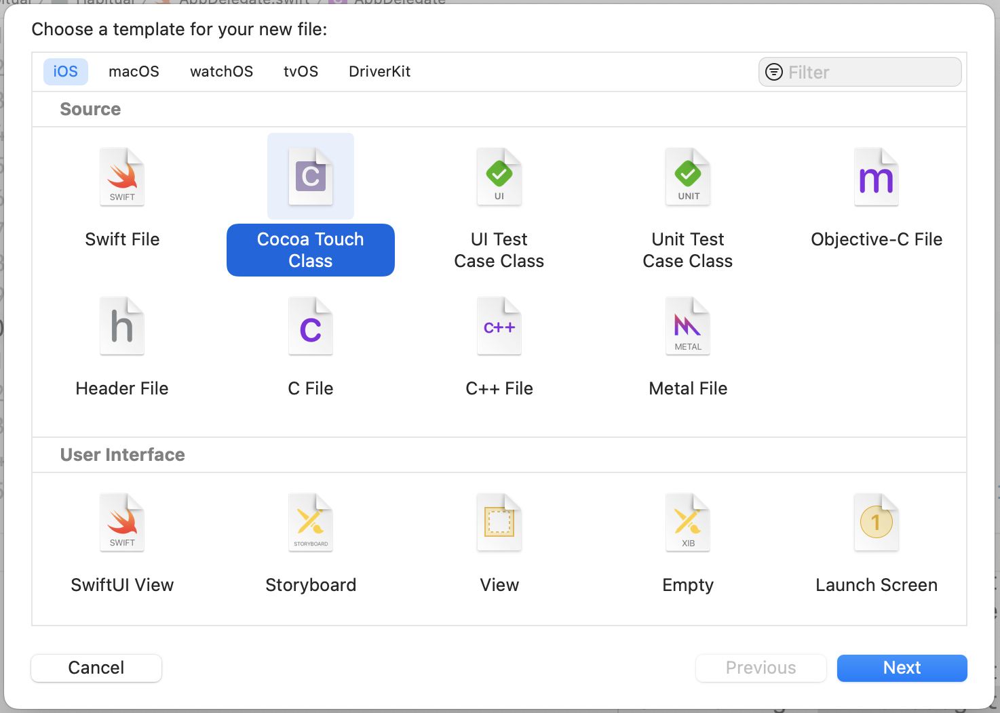

> Set the name to "AddHabitViewController", then Choose Subclass of `UIViewController` and check "Also create XIB file"

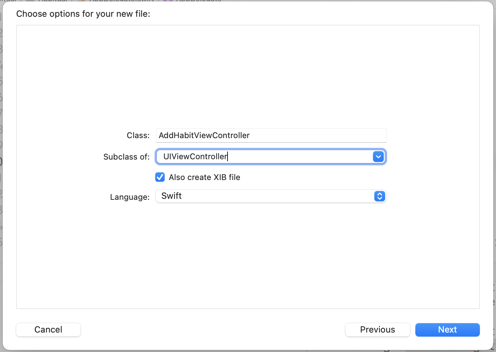

This will be the view controller that will have our collection view, now let us add that.

Note! Xcode was crashing when I moved XIB files in the file tree. Save file to views folder when creating it. 

> [action]
> Open `AddHabitViewController.xib` you should see a view. In the interface objects library, search for a `CollectionView` and drag and drop it into your new view controller.

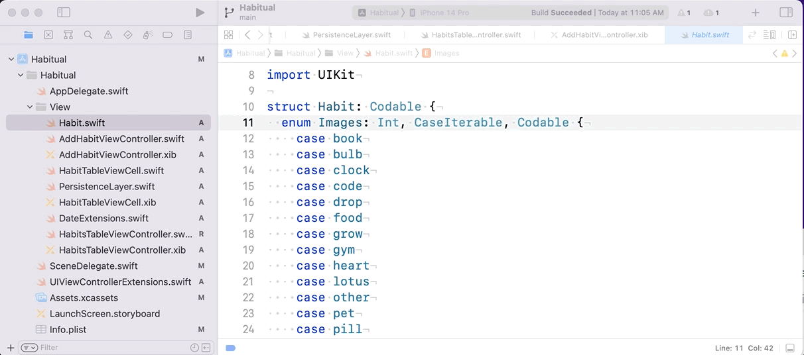

A collection view (`UICollectionView` class) is a view that manages a collection of things. Similar to a table view that manages a list of things. Where the tableview displays its list in rows the collectionview is more flexible and display a grid or other visual arrrangement. 

>[action]
> The collectionview, like the tableview, has a datasource and a delegate. You need to make these conections. Select the collectionview, open the connections inspector, and connect the **datasource** and **delegate** to the **file's owner**. 

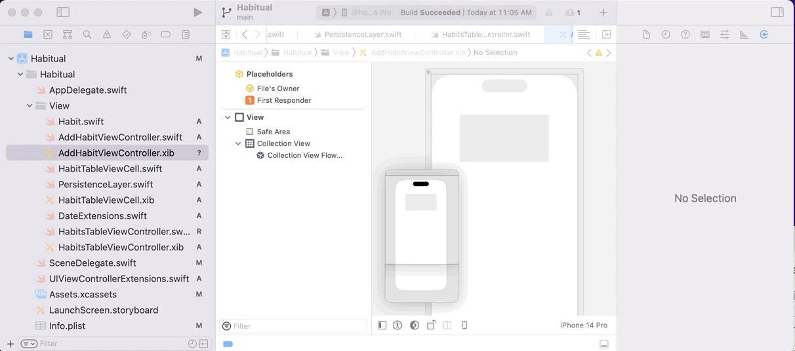

Now your collection view knows what is responsible for handling the datasource and the delegate, in this case it will be the `AddHabitViewController` class.

To finish off the actual layout on this view controller, let us add a button at the bottom that will be pressed once the user picks an image for their habit.

>[action]
> In our interface objects library search for a `Button` and drag and drop it to the bottom of our view controller and change its text to *Pick Photo*

## Constraining our CollectionView

Great, now let us constrain our new collection view and button

> [action]
> Using AutoLayout, constrain the collection view to have the following constraints(The height of the Collection View should be 0.75 proportional to the height of the superview):

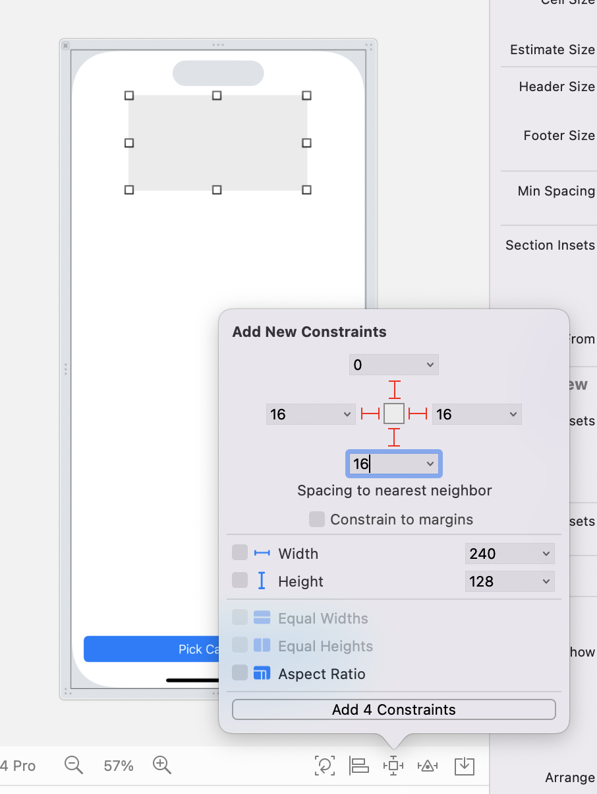

> Also Constrain the button to have a *height* of  *50* and *trailing and leading spaces* to be *16* and the bottom to be aligned *0* from the bottom of the super view

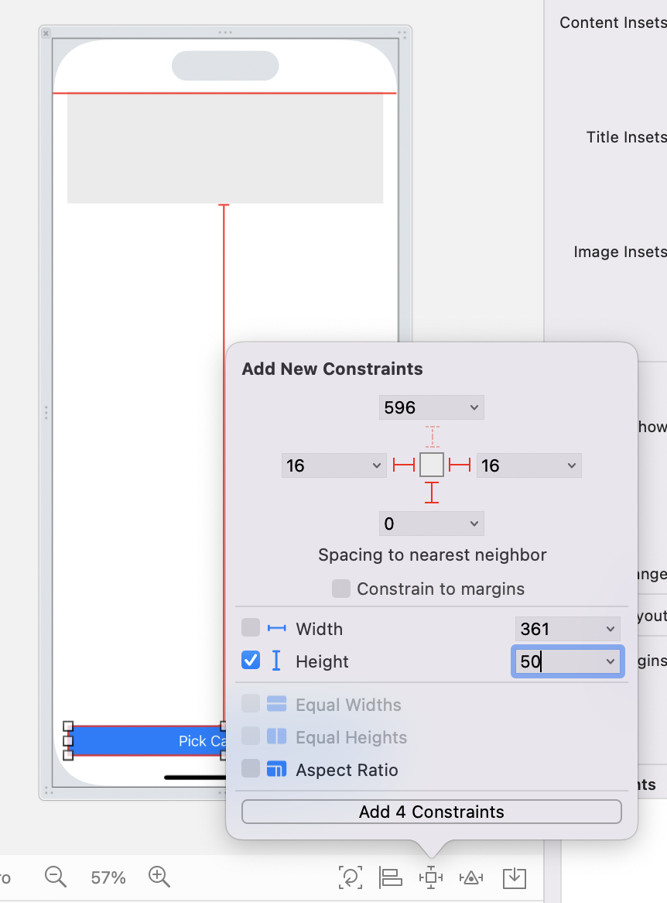

Our resulting `AddhabitViewController` should look like this:

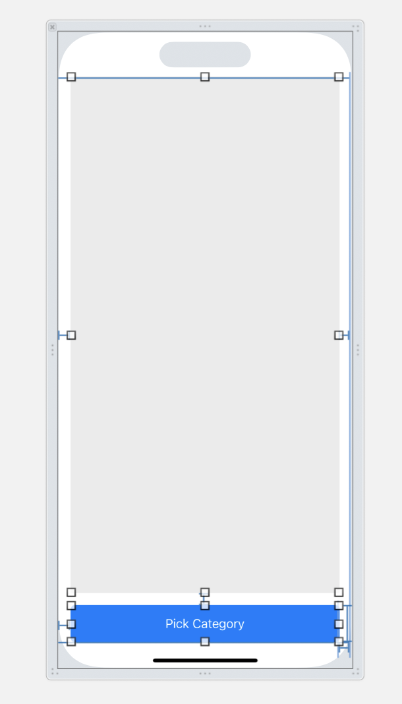

## Navigating to the Add Habit View Controller

Unfortunately, we have this new view controller, but no way to get to this view controller from our `HabitsTableViewController`, lets go back into our `HabitsTableViewController` and instead of the adding a new habit in the add button, we are going to add the code that will allow us to navigate to our new `AddHabitViewController`:

> [action]
> In the `pressAddHabit()` function, create an instance of our new `AddHabitViewController` and also create a `UINavigationController` and put our new `AddHabitViewController` imbedded into our `UINavigationController` and then *present* the `UINavigationController`

```Swift
@objc func pressAddHabit(_ sender: UIBarButtonItem) {
    let addHabitVC = AddHabitViewController.instantiate()
    let navigationController = UINavigationController(rootViewController: addHabitVC)
    navigationController.modalPresentationStyle = .fullScreen
    present(navigationController, animated: true, completion: nil)
}
```

Here you are creating an instance of the new `AddHabitViewController`. Then creating a new instance of `UINavigationController`. You need this navigation controller to switch between different views. Like navigating from one web page to another. Last you use the navigation controller to display `addHabitVC` as a modal. 

Modal display is when a view is displayed temporarily in front of another view. 

Testing at this stage your app should display, but tapping the + will produce an error because the `AddHabitViewController` is not providing collection view with the information that is required. 

## CollectionView Cells

Just like the Tableview you created a custom cell for each row, you will create a custom collection view cell to display each item in the collection view. 

We finally finished the initial setup of our `AddHabitViewController`. We can now move into some code to allow our collection view to show some content.

To show an item in our collection view, we have to layout our cell that will be displayed as a single "item" in our collection view. This cell will simply just be an ImageView.

>[action]
> Create a new Cocoa Touch Class and name it `HabitImageCollectionViewCell` and have it subclass `UICollectionViewCell` and also check the box that creates the XIB file for you and press next.


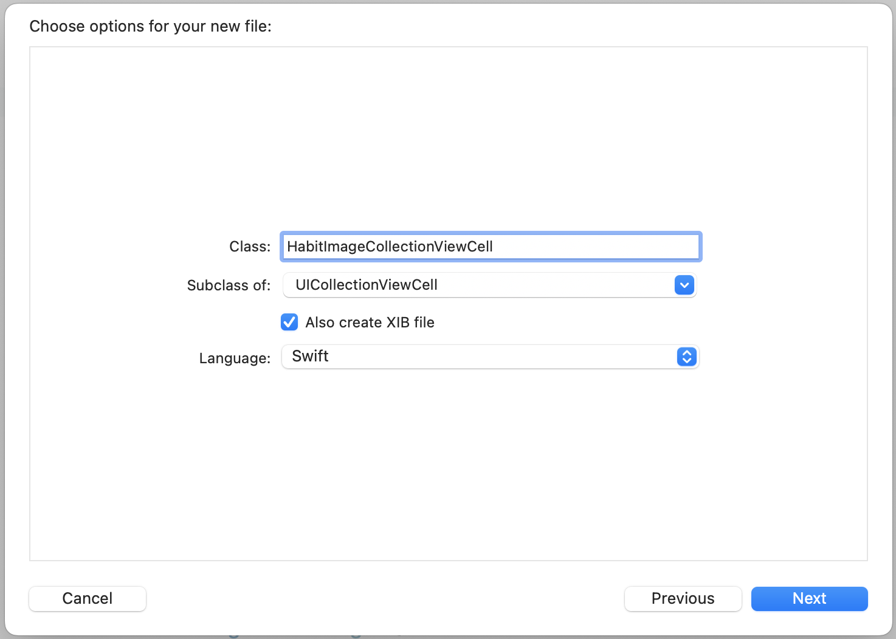

>[action]
> In our new xib file, drag an *image view* from the object library and create an `IBOutlet` named *habitImage*. Move it to inside the cell and then constrain the new *image view* to be the size of the cell itself.Set your image view's auto layout *constraints to 0 on all sides*.

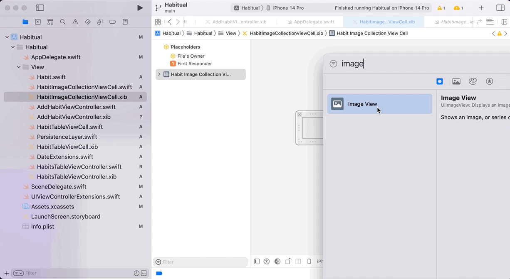

Our new cell class is also going to need to use a reuse identifier to be set also and our imageView's content mode needs to be set to Aspect Fill :

>[action]
> Select the *collectionViewCell* and then in the *attributes inspector*, set the *identifier* to *HabitImageCell*. 

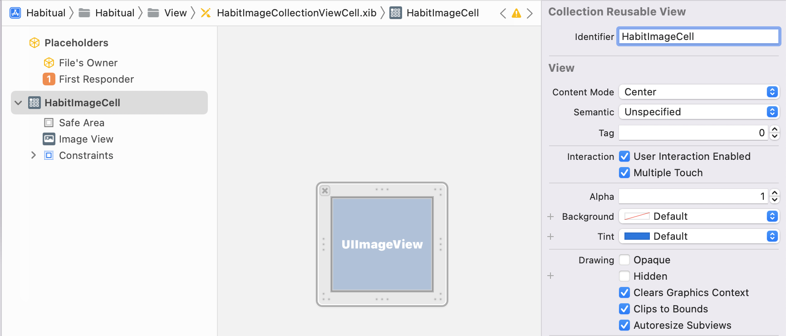

> Then click the *imageView* and then click on the *attributes inspector* and set the *content mode* to *Aspect Fit*  

Now we are on our way to be able to write some code!

>[action]
> Open the `HabitImageCollectionViewCell` and delete the code `awakesFromNib()` as we will not be needing this. Now we will add the following code that will be enough to have our cell fully configured.

```Swift
class HabitImageCollectionViewCell: UICollectionViewCell {
    @IBOutlet weak var habitImage: UIImageView!
    static let identifier = "HabitImageCell"

    static var nib: UINib {
        return UINib(nibName: String(describing: self), bundle: nil)
    }

    func setImage(image: UIImage){
        self.habitImage.image = image
    }
}
```

You need to connect that IBOutlet. 

> [Action]
> Open `HabitImageCollectionViewCell.xib` then open `HabitImageCollectionViewCell.swift` in the assistent editor (option click) so they are side by side. Drag from the little circle next to `@IBOutlet weak var habitImage` to the ImageView in the xib file. 

## Setup the Add Habit View Controller

Next you will create a static variable which allows us to access that property within our `AddHabitViewController`, and also allowing the cell's nib to be called and used for initialization in the future. The `setImage()` property sets the specific image for the cell that will be called in our datasource methods over in our `AddHabitViewController`.

>[action]
> Head over to the `AddHabitViewController` and lets create an `@IBOutlet` for our collection view and lets name it `collectionView` and to also create an `@IBAction` for our button and we will call it `pickPhotoButtonPressed`

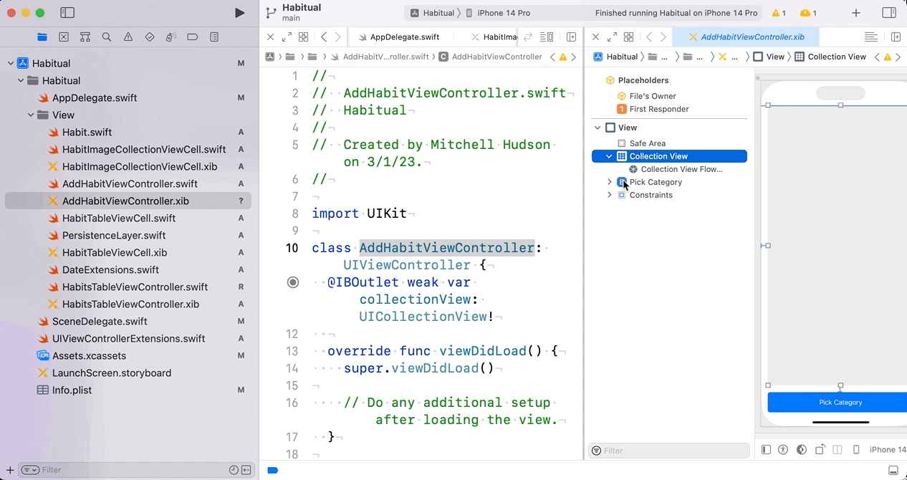

We need the `collectionView` to register the cells that we just created with the identifier that we just set.

>[action]
> In `AddHabitViewController.swift` find `viewDidLoad()` add the following code

```Swift
override func viewDidLoad() {
    super.viewDidLoad()
    collectionView.register(HabitImageCollectionViewCell.nib, forCellWithReuseIdentifier: HabitImageCollectionViewCell.identifier)
}
```

Awesome! Before we jump right into the collection view methods, we will need to do some final setup of our view controller:

>[action]
> Add the following:

```Swift
override func viewDidLoad() {

...

  setupNavBar()    

}
```

We will have to define a setupNavBar function. Add the following code to the `setupNavBar()` function below the `viewDidLoad` method

```Swift
    func setupNavBar() {
        title = "Select Image"

        let cancelButton = UIBarButtonItem(barButtonSystemItem: .cancel, target: self, action: #selector(cancelAddHabit(_:)))
        navigationItem.leftBarButtonItem = cancelButton

    }
```

Note the `#selector` which will mean that whenever our new cancel button is pressed, it will look for a function called `cancelAddHabit()`. Let us add that code right below, and don't forget to add the @obj since the #selector syntax is part of objective C , but we wont go into depth about that right now.

>[action]
> Add the `cancelAddHabit()` function below the `setupNavBar()` function:

```Swift
@objc func cancelAddHabit(_ sender: UIBarButtonItem) {
    self.presentingViewController?.dismiss(animated: true, completion: nil)
}
```

This work hasn't added much visually to the project but internally it adds important functionality that needs to be in place to make the app function. 

So far the Add Habit view will still throw an error. You'll fix this in the next step. 

## CollectionView Extension

To keep our code cleaner, we are going to use an `extension` that visually allows us to separate the collectionView related methods so that we can easily keep track of what is going on with our collection view, or else things would get pretty hectic.

The goal is to show all of the images in the collection view. It should look something like this when you're done: 


To do this you need a list of all of the images. The `Habit` class will supply this. You can add a variable here to hold the list. 

> [Action]
> In `AddHabitViewController.swift` find: `class AddHabitViewController: UIViewController {`. Add this to the top of the class. 

```Swift
let habitImages = Habit.Images.allCases
```

>[action]
> create an `extension` below your `AddHabitViewController` and add the following code:

```Swift
class AddHabitViewController: UIViewController{
    
    ... // All of the code in  AddHabitViewController

} // class ends here! 

// Add the extension below AddHabitViewController class!
extension AddHabitViewController: UICollectionViewDataSource, UICollectionViewDelegate, UICollectionViewDelegateFlowLayout {

}
```

This gets an array of all cases from the `Habit.Images` enum. You did this work earlier, it's paying off now! 

Xcode should now be yelling at us that our view controller does not conform to the `UICollectionViewDataSource` protocol. We can change this by clicking on the red box and clicking `fix` on the error message and it will give us our code stubs, or just add this code:

```Swift
extension AddHabitViewController: UICollectionViewDataSource, UICollectionViewDelegate, UICollectionViewDelegateFlowLayout {
    func collectionView(_ collectionView: UICollectionView, numberOfItemsInSection section: Int) -> Int {

    }

    func collectionView(_ collectionView: UICollectionView, cellForItemAt indexPath: IndexPath) -> UICollectionViewCell {

    }
}
```

The UICollectionView, like the UITableView, needs to know how many items it needs to display. In this app you're going to display a cell for each of the category images/icons. 

The function that's responsible for telling the collection view how many items to display is: `collectionView(..numberOfItemsInSecion)`. 

> [Action]
> Find `collectionView(_ collectionView: UICollectionView, numberOfItemsInSection section: Int) ...` in `AddHabitViewController` it should be in the extension. Return the count of the habit images. 

```Swift
func collectionView(_ collectionView: UICollectionView, numberOfItemsInSection section: Int) -> Int {
    return habitImages.count // <- add this
}
```

Just like the table view the collection view needs it's delegate to provide the cells it needs to display. This is handled in the `collectionView(..cellForItemAt)` method. 

You made a custom cell for this purpose earlier. 

> [Action] 
> Find the `func collectionView(_ collectionView: UICollectionView, cellForItemAt indexPath: IndexPath)` in `AddHabitViewController`, it's in the extension. Add the code below to create and configure a new cell.

```Swift
func collectionView(_ collectionView: UICollectionView, cellForItemAt indexPath: IndexPath) -> UICollectionViewCell {
    // Add the from here
    let cell = collectionView.dequeueReusableCell(withReuseIdentifier: HabitImageCollectionViewCell.identifier, for: indexPath) as! HabitImageCollectionViewCell
    cell.setImage(image: habitImages[indexPath.row].image)
    return cell
    // to here! 
}
```

The `collectionView(..cellForItemAt)` is an important function that will tell the collection view which item to display at the index path, this will make it really easy to use an array and use `indexpath.row` as an index. 

We can also add to our collection view functions to reflect some of the ideas that we just discussed.

Test your app now. Tapping the + in the upper right should show a grid of cells each filled with one of the images from the list of images. great work!

It took some effort to get to this point. The UICollectionView takes some effort and knowledge to master. You are just getting started with it. Think about all of the apps that you use everyday. See if you can idenitify any that use the collection view? Probably most if not all of them! UICollectionView is one of the important classes in iOS UI development. 

## Cell Formatting

Our content is all finished for our collection view, but now we need to do some formatting using our `UICollectionViewDelegateFlowLayout`.

The `UICollectionViewDelegateFlowLayout` class is a class dedicated to formatting and arranging cells in a collection view. You will use it here. You need to add the `collectionView(..minimumLineSpacingForSectionAt:)`. That's a long name but the code editor will help you! We call this method: `minimumLineSpacingForSectionAt`.

> [Action]
> Start by adding a method to the `extension AddHabitViewController` in `AddHabitViewController.swift`. Let the code editor help you. Make some space inside the extension, not inside any of the other methods. Start typeing the name: "minimumLin..." when the menu displays look for `minimumLineSpacingForSectionAt` select this from the menu and double click or type return/enter. 


> [Action] 
> The method you just added, `minimumLineSpacingForSectionAt`, needs to return the spacing between sections. return 10.0

```Swift
func collectionView(_ collectionView: UICollectionView, layout collectionViewLayout: UICollectionViewLayout, minimumLineSpacingForSectionAt section: Int) -> CGFloat {
    return 10.0
}
```

Collection view wants to know the size for items at an indexpath. The delegate is responsible for this via the `collectionView(..sizeForItemAt:)` method. We call this method `sizeForItemAt`. Use the same technique to get the code editor to add this method. 

> [Action]
> Put the cursor inside the `extension AddHabitViewController`. Start typing "sizeForItemAt", when the menu shows up look for `collectionView(..sizeForItemAt:)` and select this. 


You will calculate the size of the cells by looking at the size of the collectionview and make them 1/4 of the width. You will return a `CGSize` object. A `CGSize` object has properties of `width` and `height`. 

> [Action]
> Inside the `sizeForItemAt` method add the following: 

```Swift
func collectionView(_ collectionView: UICollectionView, layout collectionViewLayout: UICollectionViewLayout, sizeForItemAt indexPath: IndexPath) -> CGSize {
    // Add this
    let collectionViewWidth = collectionView.bounds.width
    return CGSize(width: collectionViewWidth/4, height: collectionViewWidth/4)
}
```

Test your work. It should look similar to this: 

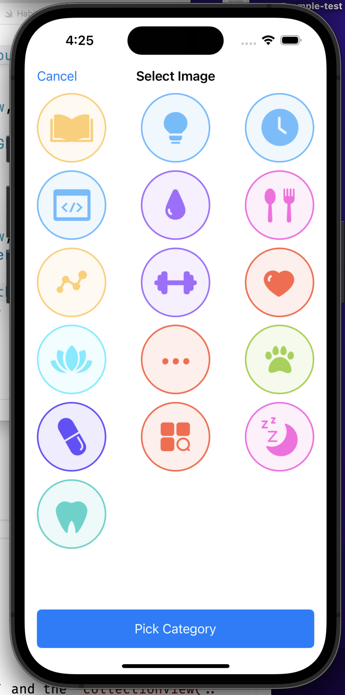

Time to add a little space around the images. UICollectionView has a method for this! It's written: `func collectionView(_ collectionView: UICollectionView, layout collectionViewLayout: UICollectionViewLayout, insetForSectionAt section: Int)` but we call it: `insetForSectionAt`. Use the code editor to do the work of typing this for you! 

> [Action]
> Find `extension AddHabitViewController`, make some space inside this extension. Start typing: `insetForSectionAt`, when the menu pops up find `collectionView(_ collectionView:layout:insetForSectionAt section:)` and select it. 


Insets are the space around the edges. Think of it like padding or margin. You probably won't find it hard to believe but, UIKit has a special class for insets! 

The goal here is to add some space on the left and right of each section. The `insetForSectionAt` expects you to return a `UIEdgeInsets` object. This object has properties for `top`, `bottom`, `left`, and `right`. The values of each of these determines how much space to place at each edge. 

> [Action]
> Inside the `insetForSectionAt` method make a `UIEdgeInsets` instance and return it. 

```Swift
return UIEdgeInsets(top: 0, left: 10, bottom: 0, right: 10)
```

Test your work, should look something like this: 

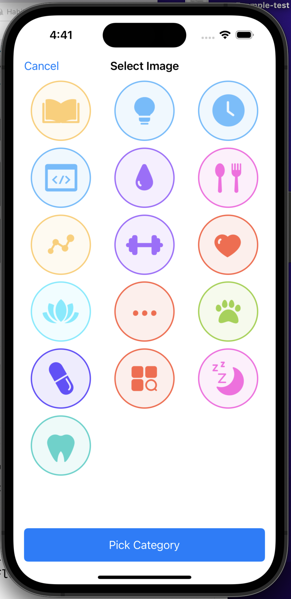

Not a big change since the last time you tested. Look closely and you'll that the images are pushed in from the left and right edges. You can adjust the numbers above to what you think looks best. 

# Selecting the images

The sole point of this screen is to be able to *select* an image for our new habit. We can do this with an animation, taking advantage of prebuilt method from UICollectionView.

>[action]
>Add the following at the top of **AddHabitViewController**

```Swift
var selectedIndexPath: IndexPath? {
    didSet {
        var indexPaths: [IndexPath] = []
        if let selectedIndexPath = selectedIndexPath {
            indexPaths.append(selectedIndexPath)
        }
        if let oldValue = oldValue {
            indexPaths.append(oldValue)
        }
        collectionView.performBatchUpdates({
            self.collectionView.reloadItems(at: indexPaths)
        })
    }
}
```

We created a property to track what indexPath we have selected. It has an observer to detect when that value changes. When we select a new indexPath, we get to the first if statement. If we selected the same item twice, we get to the second if statement. Then we call the method `performBatchUpdates` that will take care of reloading the corresponding items in the collection view. Now let's see where `selectedIndexPath` must change.

Add the `shouldSelectItemAt`. This method tells the collection view if it should select an item or not.

> [Action]
> Put the cursor inside the `extension AddHabitViewController` and start typing "shouldSelectItemAt". When you see `collectionView(_ collectionView:, shouldSelectItemAt:)` select it. 

This method returns a Boolean, true or false. It receives the indexpath of currently selected item. It's your job as developer to return true if that item should be selected and false if not. 

```Swift
func collectionView(_ collectionView: UICollectionView, shouldSelectItemAt indexPath: IndexPath) -> Bool {
    if selectedIndexPath == indexPath {
      selectedIndexPath = nil
    } else {
      selectedIndexPath = indexPath
    }
    return false
}
```

Here we are changing the value of our property right when the collection view detects we want to select an item (just before it actually gets selected). Let's have a visible difference between selected and non selected cells.

> [action]
> Find the `cellForItemAt` in the extension with all of the collectionview methods. This function reads: func `collectionView(_ collectionView: UICollectionView, cellForItemAt indexPath: IndexPath)`. 
> Update the method in the extension to match the following:

```Swift
func collectionView(_ collectionView: UICollectionView, cellForItemAt indexPath: IndexPath) -> UICollectionViewCell {
    let cell = collectionView.dequeueReusableCell(withReuseIdentifier: HabitImageCollectionViewCell.identifier, for: indexPath) as! HabitImageCollectionViewCell
    if indexPath == selectedIndexPath{
        cell.setImage(image: habitImages[indexPath.row].image, withSelection: true)
    }else{
        cell.setImage(image: habitImages[indexPath.row].image, withSelection: false)
    }
    return cell
}
```

This produces an error because you added an extra argument `withSelection` to `setImage(image:withSelection)`. You'll fix this in the next step. 

The idea is that you are sending over a boolean value when creating the cell to specify if it should be drawn differently if selected or not. Let's make the actual difference happen in the cell's class.

> [action]
> Open `HabitImageCollectionViewCell.swift` and find the `setImage` method. Make it match the code below:

```Swift
func setImage(image: UIImage, withSelection: Bool) {
    if withSelection {
      self.habitImage.image = image.withRenderingMode(.alwaysOriginal)
    } else {
      self.habitImage.image = image.withRenderingMode(.alwaysTemplate)
      self.habitImage.tintColor = UIColor.gray
    }
}
```

With this change the images are drawn normally it `withSelection` is true. If `withSelection` is false the image is drawn with a gray tint. 

Test your app. The habit list is still empty. Tap the + in the upper right. This should display the list of category images. They all appear gray, the tint color has been applied because none have been selected. Tap one of the images. It becomes selected and displays in color! Tap another. That image becomes selected, shows in color, and the previously selected image is tinted gray. 

# Summary

In this section, you learned how to create a collection view and also how to create a custom collection view cell that updates with animations. You also practiced your Auto Layout skills to constrain the layouts that we created, and then followed readability practices with `extensions` to make our code more readable. You also learned how to implement the datasource, delegate and layout protocols for collection views and this allowed us to be able to display all the images of possible habits that we wanted. We made so much progress on this page! Take a break, you deserve it, and come back ready for part two of adding the habits.
