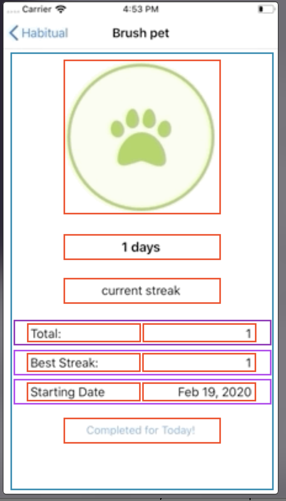

# Detailing a Habit

Now that we are able to persist a user's habits, we should give them a way to be able to see a detailed view of their habits.


This is something similar to what the finished detail view will look like!

## Creating the details view controller

You will be creating a new view and xib  file! This details view will show details about any one of the habits in the list. 

> [Action] 
> Create a new view and xib named: `HabitDetailViewController` make it a subclass of `UIViewController`.

Let's model the xib as seen in the recording up above. You should be familiar with placing elements in a `UIStackView`.

Once you have the design implemented, let's connect our design elements to the corresponding .swift file!

> [Action]
> Layout this view in the xib file. You need: 
> - Image view to show the category icon
> - label to show the number of days
> - label for the current streak
> - label for total and label for number
> - label for best streak and label for number
> - label for starting date and label for date
> - button for complete today



This picture shows the UI elements (images, labels, and button) in red. Imagine the blue box is an outer, vertical stack view that contains everything. The three purple boxes are horizontal stack views that contain two labels. 

The tree view might look like this: 

- View
    - Vertical Stack
        - Image
        - Days label
        - current streak label
        - Total Stack
            - Total Label
            - Total count
        - Best Stack
            - Best streak label
            - Best count
        - Starting Date stack
            - Starting Date Label 
            - Date label
        - Completed Button

Your job is to build this view! You've done this three or more already! Review the previous steps in this tutorial for ideas.  

## Add IBOutlets and IBActions

Next you need to add some IBOutlets and IBActions. Here are the names I used. If you use different names you have to adjust the code in the upcoming section! Spelling matters! 

Add the following IBOutlets

- `imageViewIcon` - UIImage
- `labelCurrentStreak` - UILabel
- `labelTotalCompletions` - UILabel
- `labelBestStreak` - UILabel
- `labelStartingDate` - UILabel
- `buttonAction` - UIButton

Add an IBAction to the for the button. 

- `pressActionButton` - UIButton


Add a property to hold the habit that will be displayed. When this view is displayed you'll set the habit displayed on a variable in this view controller and the view controller will display it when it appears. 

> [Action]
> Add two variables to the top of the view controller.

```Swift 
var habit: Habit!
var habitIndex: Int!
```

When you're done this view controller should look like this: 

```Swift
import UIKit

class HabitDetailedViewController: UIViewController {

    var habit: Habit!
    var habitIndex: Int!

    private var persistence = PersistenceLayer()

    @IBOutlet weak var imageViewIcon: UIImageView!
    @IBOutlet weak var labelCurrentStreak: UILabel!
    @IBOutlet weak var labelTotalCompletions: UILabel!
    @IBOutlet weak var labelBestStreak: UILabel!
    @IBOutlet weak var labelStartingDate: UILabel!
    @IBOutlet weak var buttonAction: UIButton!

    override func viewWillAppear(_ animated: Bool) {
        super.viewWillAppear(animated)
    }
    @IBAction func pressActionButton(_ sender: Any) {
        
    }

}
```

## File Organization

You have a lot of files. It's important to understand what each file is responsible for. This project uses the standard naming conventions you would find on a professional iOS job. 

The names might be seem long but they are trying to convey what each file is and how it functions in the app. The naming tries to be self documenting. 

Lets review all of the files: 

- `Habit` - Defines the struct that represents a single habit. The app is making instances of this struct each time a new habit is created.
- `PersistenceLayer` - This struct manages saving and retrieving saved app data 
- `DateExtensions` - Defines some helper methods to help us work with dates. 
- `HabitTableViewController` - A view that displays the list of habits in a tableview
    - `HabitTableViewController.swift` - contains the `HabitTableViewController` class.
    - `HabitTableViewController.xib` - The interface builder file that defines the user interface
- `HabitTableViewCell` - Displays a row in the HabitsTableView
    - `HabitTableViewCell.swift` - Contains the class that is responsible for the behavior of a cell
    - `HabitTableViewCell.xib` - The interface builder file that defines the user interface of a cell. 
    - Note! An instance of `HabitTableViewCell` is created for each cell! 
- `AddHabitViewController` - Creates the view that displays a view showing the category icons in a collection view. 
    - `AddHabitViewController.swift` - Defines the class that creates this view and manages the collection view
    - `AddHabitViewController.xib` - The interface builder file that defines the user interface for this view. 
- `HabitImageCollectionViewCell` - Defines the collection view cell used in the Add Habit view. 
    - `HabitImageCollectionViewCell.swift` - has the code that initializes a cell
    - `HabitImageCollectionViewCell.xib` - The interface builder file that describes the collection view cell. 
- `ConfirmHabitViewController` - Creates the view that follows the AdddHabit view, displaying a text field and image, this view creates a new habit. 
    - `ConfirmHabitViewController.swift` - Contains the code responsible for dipslaying the chosen image and creating a new habit in the persistence layer. 
    - `ConfirmHabitViewController.xib` - Contains the user interface for this view. 
- `HabitDetailViewController` - Detail view is shown when a habit in the tableview is tapped. It shows info about the habit and has a button that allows us to complete a habit for the day. 
    - `HabitDetailViewController.swift` - This will have the logic needed to display habit details and complete the habit for the day. 
    - `HabitDetailViewController.xib` - Defines the UI for the details view. 

Wow so many files! Notice the patterns.

- View controllers are responsible for displaying a "view" or app "screen". This is a whole screen of information. 
- Every view controller has a swift file and a xib file. The swift has the code and provides the logic for creating the screen, the xib is responsible for the UI elements used in that screen. 
- The table view and collection views manage lists of cells. A cell is a view and the table or collection view creates instances of a cell and configures so each cell displays something different. 
- Each cell is a view and has it's own swift and xib file! 
- There are a couple swift files that contain code used by the app and shared by all of the views. 

**You should read all of this again and open each of the files named on the list above and revisit the code you wrote.** 

Notice the naming conventions. All view controllers get a name and the `ViewController`. The collection view and table view controllers get a name and the name `TableViewController` or `CollectionViewController`. The same is true for the table view and collection view cells. 

The pattern here is that files are named after their purpose and their class. For example. `HabitDetailViewController` is named after the Habit Detail, its purpose, and ViewController its class. 

All of the classes are named this way! Naming is important. You will have mamy files to work with and need to understand what is going on in each. The names will help you navigate the files! 

## Selecting a row in the tableview

The idea here is to select a cell in the habits table and display details for that habit. To do this you need to detect a tap on a cell, create the details view, display the view, and pass the habit information to view. 

To do this you'll use one of the tableview delegate methods: `didSelectRowAt:`. Hopefull you're getting the concept of the delegate. TableView knows when a row was tapped but doesn't know what our app wants to do when a row is tapped, so it **delegates** that to a function that you define, in this case `didSelectRowAt:`. 

Which is really `func tableView(_ tableView: UITableView, didSelectRowAt indexPath: IndexPath)`. This may seem confusing. There are many methods that begin `func tableView(_ tableView: UITableView, ...` so we name the method by the unique parameter. In most cases this name also describes what the method does. 

When a row is tapped you'll do the same things you did to display the other view controllers, but this time you'll display the details view controller. 

> [Action]
> Open `HabitsTableViewController.swift`. Inside the class, start typing `didSelectRowAt` when the code hints show `func tableView(_ tableView: UITableView, didSelectRowAt indexPath: IndexPath)` select that method. 

> Add the following code insdie the new method:

```Swift
override func tableView(_ tableView: UITableView, didSelectRowAt indexPath: IndexPath) {
    let selectedHabit = persistence.habits[indexPath.row]
    let habitDetailVC = HabitDetailViewController.instantiate()
    habitDetailVC.habit = selectedHabit
    habitDetailVC.habitIndex = indexPath.row
    navigationController?.pushViewController(habitDetailVC, animated: true)
}
```

The code above does the following:

- Retreives the habit from the persistence layer. There are many habitsso you supply the indexPath.row number to get one of them from the array. 
- Instantiate the `HabitDetailsViewController`
- Set the selected habit on the habit detail view controller. You need this to display the habit info
- Set the habit index on the habit detail view controller. You need this so the detail view knows which habit to update
- Last, show the newly instantiated view controller. 

If you refer back to our persistence layer tutorial page you'll remember making a `markHabitAsCompleted` method. When a user presses the complete button we want add the logic of marking that habit as completed in our persistence layer!

The next step is to update the detail view UI when the "complete task for the day" button is tapped.

> [Action]
> Open `HabitDetailViewController.swift` and add the new method below: 

```Swift
private func updateUI() {
    title = habit.title
    imageViewIcon.image = habit.selectedImage.image
    labelCurrentStreak.text = "\(habit.currentStreak) days"
    labelTotalCompletions.text = String(habit.numberOfCompletions)
    labelBestStreak.text = String(habit.bestStreak)
    labelStartingDate.text = habit.dateCreated.stringValue

    if habit.completedToday {
        buttonAction.setTitle("Completed for Today!", for: .normal)
    } else {
        buttonAction.setTitle("Mark as Completed", for: .normal)
    }
}
```

> Next call this new method from `pressActionButton` IBAction method. 

```Swift
@IBAction func pressActionButton(_ sender: Any) { 
    habit = persistence.markHabitAsCompleted(habitIndex)
    updateUI()
  }
```

> Last, call `updateUI` from the `viewDidLoad` method. This will update the UI when the view loads so that it displays the habit info when the view first appears. 

```Swift
override func viewWillAppear(_ animated: Bool) {
    super.viewWillAppear(animated)
    updateUI()
}
```

Test your work. At this stage you should be able to display the list of habits. Habits should persist, that is the habits you enter before quiting the app should appear when you run the app a second or third time. 

Tapping a row should display the details view, and the details view should display the habit you tapped. 

Tapping the "Complete for Today" button should mark that habit as complete. The count should increment by one, and the best streak should show 1. 
